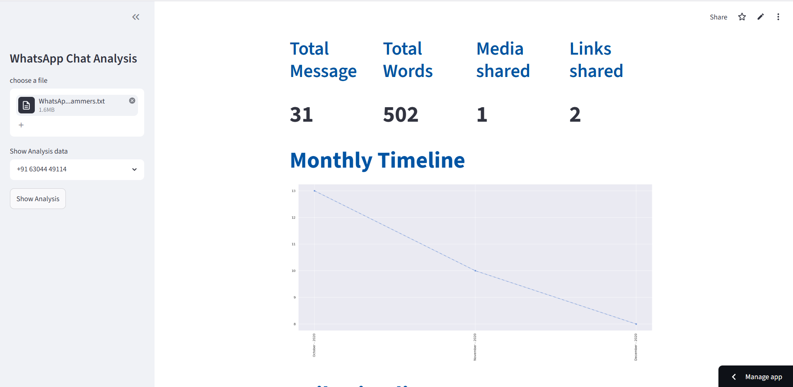

# WhatsApp Chat Analysis

## Project Overview

WhatsApp Chat Analysis is a data analytics application that extracts meaningful insights from exported WhatsApp conversations. The project combines data preprocessing, exploratory data analysis, visualization, and web application deployment to help users understand communication patterns, engagement levels, and user behavior within individual and group chats.

## Key Features

### Data Preprocessing

* Parsed and cleaned raw WhatsApp chat exports.
* Extracted timestamps, users, messages, emojis, and media indicators.
* Handled missing values and inconsistent chat formats.

### Exploratory Data Analysis

* Generated descriptive statistics including message counts, word counts, media shares, and links shared.
* Identified the most active participants within group conversations.
* Analyzed user engagement and contribution patterns.

### Text Analysis

* Extracted frequently used words and phrases.
* Created word frequency visualizations.
* Filtered stopwords and irrelevant text for meaningful insights.

### Emoji Analysis

* Identified the most frequently used emojis.
* Measured emoji usage trends across participants.
* Visualized emotional expression patterns in conversations.

### Time-Based Analysis

* Analyzed messaging activity across days, months, and years.
* Identified peak conversation periods and user activity trends.
* Generated timelines and heatmaps to visualize communication behavior.

### Web Application Development

* Built an interactive web application using Streamlit.
* Enabled users to upload WhatsApp chat files and generate instant analytics reports.
* Developed interactive visualizations for better user experience.

### Deployment

* Deployed the application to the cloud for public accessibility.
* Configured production environment and dependency management for seamless deployment.

## Technologies Used

Python, Pandas, NumPy, Matplotlib, Seaborn, Streamlit, Regex, Emoji, WordCloud

## Outcomes

* Automated the analysis of WhatsApp chat data.
* Delivered actionable insights through interactive visualizations.
* Demonstrated end-to-end skills in data preprocessing, EDA, visualization, web application development, and deployment.
